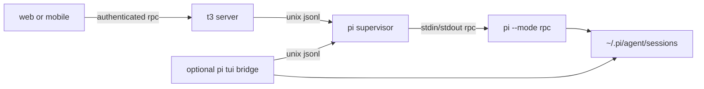
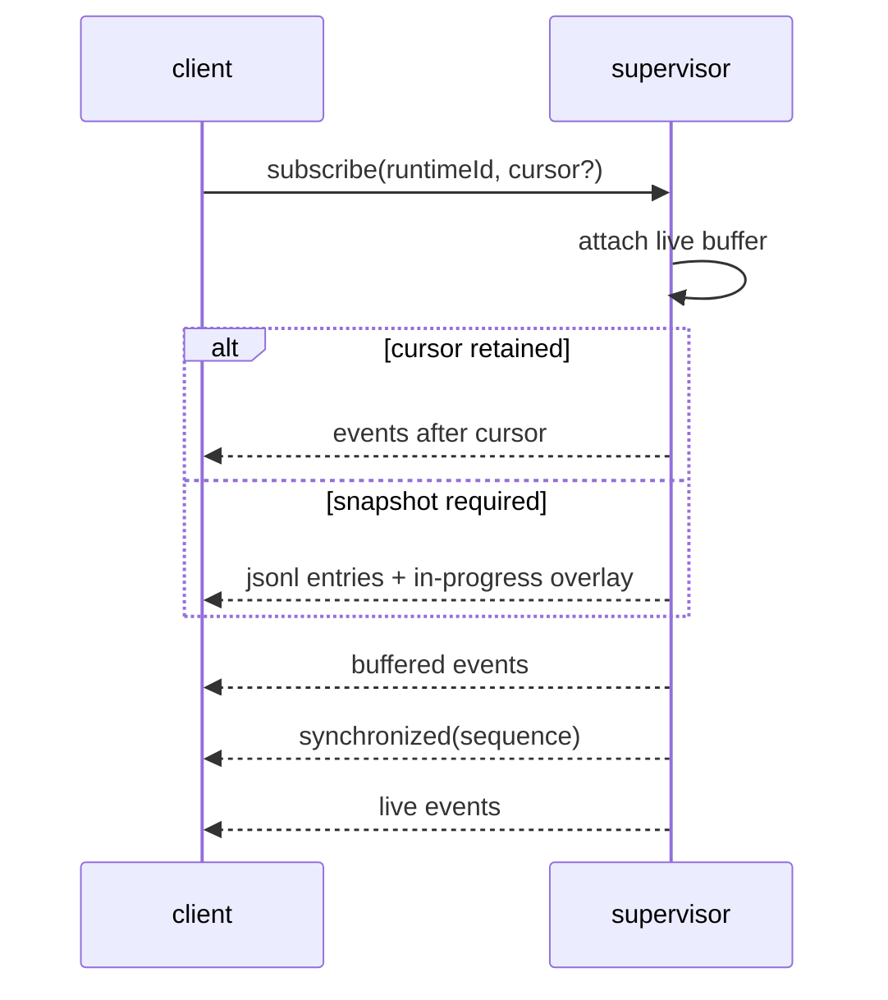

# native pi supervisor

native pi control is separate from provider orchestration. this prevents a
second thread projection from becoming an accidental source of truth for pi
history.

the supervisor listens on
`~/.pi/agent/t3-control-v1/supervisor.sock`. its directory is mode `0700`; the
socket, startup lock, and command ledger are mode `0600`. only opaque session
keys cross the client boundary. the server resolves a key through the read-only
catalog before asking the supervisor to resume a file.

## durability boundaries

the supervisor, not the t3 server scope, owns child processes. clients may
detach without stopping work. each canonical session file has at most one
registered writer.

the command ledger stores hashes and receipts only. prompts and model output
remain in pi's jsonl. an atomic `started` receipt fences retries before a command
is delivered.

runtime events receive a `(runtimeId, sequence)` cursor and stay in a bounded
ring. subscription installs its live buffer before reading a snapshot, then
emits:

the ring is not history. after settlement, jsonl is authoritative and the
transient overlay is cleared.

## limits

- an unbridged tui exposes no control channel or writer lease, so its liveness
  cannot be identified safely.
- pi rpc ids correlate responses but are not durable idempotency keys. t3 can
  prevent retries while its supervisor ledger is available; exactly-once
  acceptance across a supervisor crash requires pi to persist the command id
  with the prompt.
